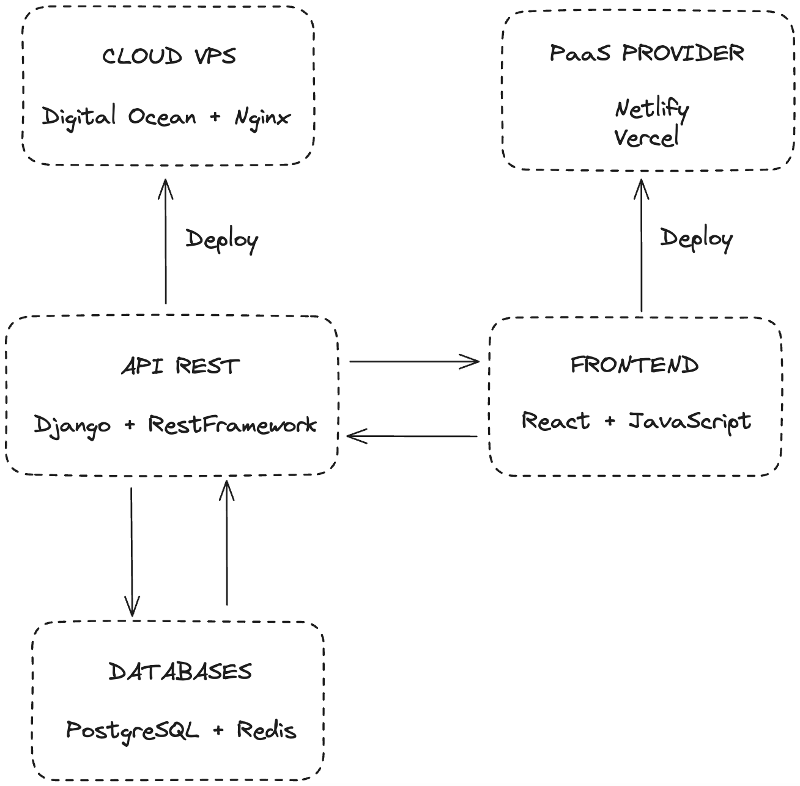

# Adalogix

Repository dedicated to creating an application that simulates logistics management, inventory, route, chat.

# PROJECT PROPOSAL FOR REQUESTING MODULE IMPLEMENTATION

# PROJECT

## Index

1. [IDENTIFICATION](#id1)
2. [OBJECTIVES](#id2)
3. [PRE-EXISTING ANALYSIS](#id3)
4. [SYSTEM PRE-ANALYSIS](#id4)
5. [SYSTEM PRE-DESIGN](#id5)
6. [COST ESTIMATION](#id6)

### 1. IDENTIFICATION 

- Project Name: Adalogix.
- Students: Alejandro Hernández, Dimas Abrante, Adrián Herrera.
- Group: G01 - ADA Team.
- Course: 2nd year of Web Application Development.
- Tutor: Alejandro Martín Zarza.

### 2. OBJECTIVES 

This project aims to improve and optimize the logistic management of a company by connecting inventory control, distribution and delivery of goods, and internal communication of the various figures involved in the correct development of all its functions.

The main objective is to help companies leave behind rudimentary and inefficient systems when managing their resources, so they can maximize profits, make the most of available resources, and quickly and effectively resolve any unfavorable circumstances.

### 3. PRE-EXISTING ANALYSIS 

Conducting an analysis of existing systems in the market, at the moment, there is no application that brings together the three most important pillars of our product; they do not automate the system, there is no commitment to optimizing the logistics of companies, nor does it facilitate internal communication.

### 4. SYSTEM PRE-ANALYSIS 

The project is divided into three main applications, each covering the following functionalities respectively:

- **Inventory.**

  - Stock control.
  - Automation of merchandise restocking.
  - Cost value of goods.
  - Sales management / Profit calculation.
  - Product loading optimization for trucks.
  - Searches, tags, categories.

- **Chat.**

  - Internal employee communication.
  - Sending various attached files.

- **Route Planner.**

  - "Smart" route planner to optimize merchandise deliveries.
  - Delivery and route history.
  - Control of times and number of deliveries per route/driver.
  - Google Maps API routes. Save destinations (coordinates) in the backend and send them to the frontend. Time estimates.

Various roles are considered to use the application, excluding the development team, there will be two basic roles. **Administrator** for inventory management, registration of **Delivery Drivers** in the application, use of chat, and management and planning of the route planner.

- **Roles.**

  - Administrator: full access to the application, responsible for inventory CRUD management, use of the route planner, access to chat and group creation, registration in the application of other roles (delivery drivers, sales representatives, etc.).

  - Delivery Driver: access to internal chat, access to chat groups, use of the route planner, will update the status of each delivery (delivered, not-delivered, partial, incident).

### 5. SYSTEM PRE-DESIGN 

The technological stack will be divided into the different areas of action for each respectively.

- **Frontend**.

  - JavaScript + React.

- **Backend**.

  - Python + Django.

- **Database**.

  - PostgreSQL + Redis.

- **Deployment**.
  - Gunicorn + Nginx + DigitalOcean.

### 6. COST ESTIMATION 

- Costs of a team of developers and analysts:

| Concept                | Quantity  |
| ---------------------- | --------- |
| Cost per hour          | 10 €      |
| Hours per day          | 8 hours   |
| Estimated time         | 50 days   |
| Developers and analist | 3 workers |
| Total cost             | 12000 €   |

- Cost of production execution.

| Concept                                                 | Quantity    |
| ------------------------------------------------------- | ----------- |
| Register domain "adalogix.io" | 556 € / 10 years |
| VPS Digital Ocean                                       | 15 € / month |
| API key (in case of more than 100.000 monthly requests) | 30 € / month |

- Cost of hardware
  | Concept | Quantity |
  | ------------------------------------------------------- | ----------- |
  | Laptops | 5400 € |
  | Office (Coworking) | 430 € / month |
  | Diets | 50 € / month |
  | Displacement | 30 € / month |
  | Formation | 200 € / year * |
